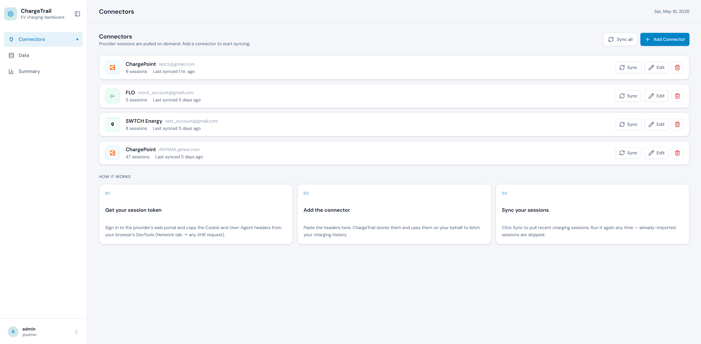
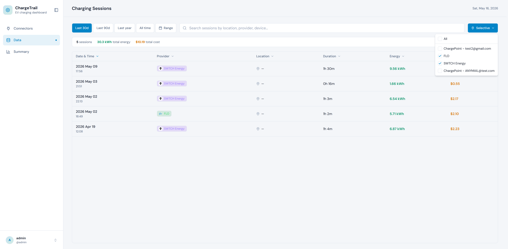
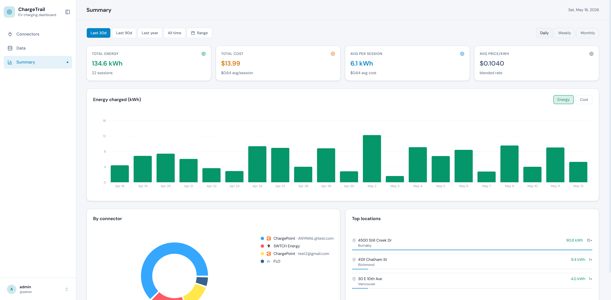
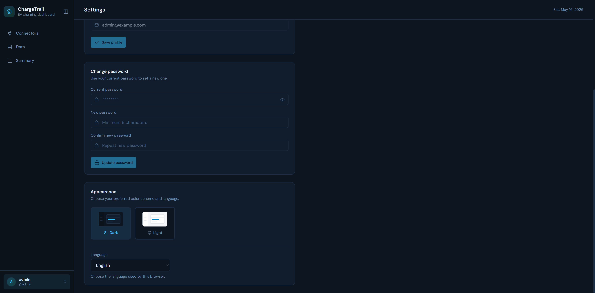

# ChargeTrail

**English** · [Français](./readme/README.fr.md) · [简体中文](./readme/README.zh-CN.md)

ChargeTrail is a web application that aggregates EV charging session data
from multiple third-party charging networks (ChargePoint, ChargeLab, BC Hydro,
and others), normalizes it into a unified data model, persists it locally in
SQLite, and exposes it through a REST API consumed by a React single-page
frontend.

It gives you a single pane of glass for charging activity that today lives
scattered across many provider portals — with offline-resilient local storage
and a pluggable adapter layer so new networks can be added without touching the
core.

## Tech Stack

- **Backend** — Node.js + Express 5, TypeScript (ESM), SQLite (better-sqlite3),
  Drizzle ORM, Zod-driven validation + OpenAPI docs.
- **Frontend** — React 18 + Vite, TypeScript, Tailwind CSS 4, shadcn/ui,
  TanStack Query, Recharts, i18next.

## Dev Environment Quick Setup

Prerequisites: **Node.js 20+** (24.x recommended) and npm.

```bash
# 1. Clone
git clone git@github.com:chnliupu/ChargeTrail.git
cd ChargeTrail

# 2. Backend
cd backend
npm install
cp .env .env.local        # adjust if needed
npm run dev               # API on http://localhost:3000
                          # Swagger UI on http://localhost:3000/api-docs

# 3. Frontend (in a second terminal)
cd frontend
npm install
cp .env.example .env      # VITE_API_ORIGIN defaults to http://localhost:3000
npm run dev               # app on http://localhost:3001
```

Common scripts (run inside `backend/` or `frontend/`):

| Command          | Purpose                          |
| ---------------- | -------------------------------- |
| `npm run dev`    | Start dev server with hot reload |
| `npm run build`  | Production build                 |
| `npm test`       | Run the test suite (Vitest)      |
| `npm run lint`   | Lint                             |
| `npm run format` | Check formatting                 |

## Pages

### Connector



### Data



### Summary



### Dark mode



## License

[MIT](./LICENSE) © chnliupu
